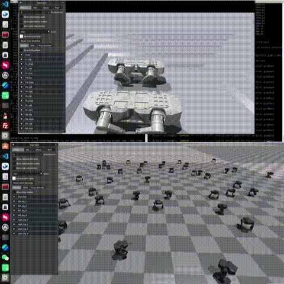
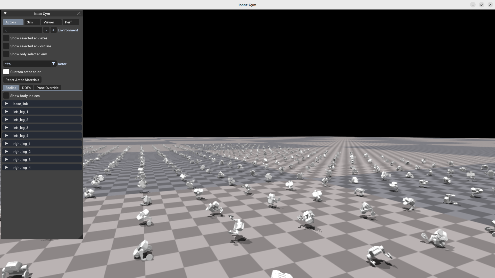
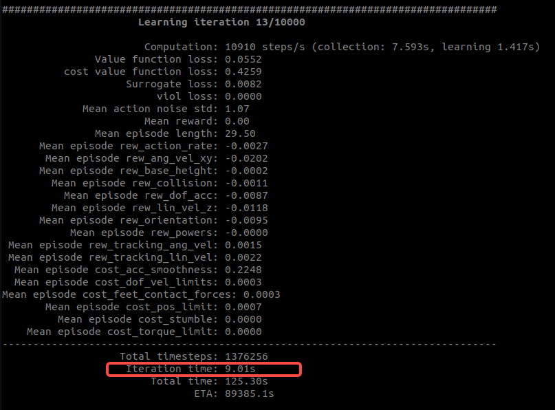
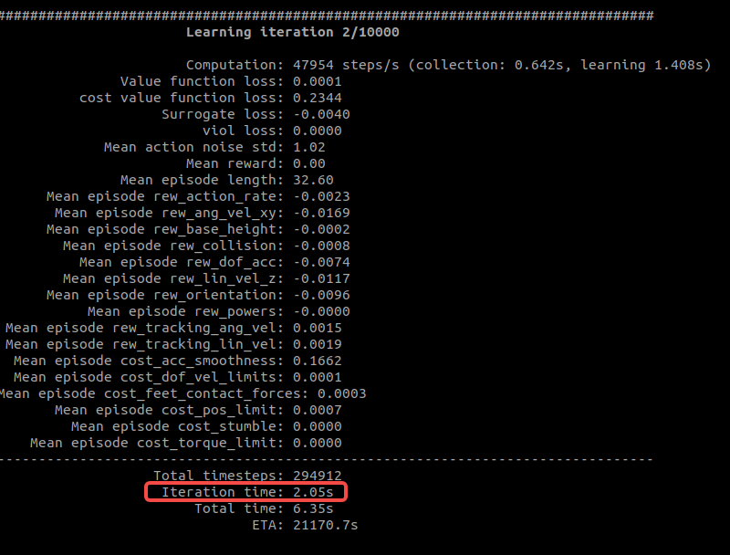
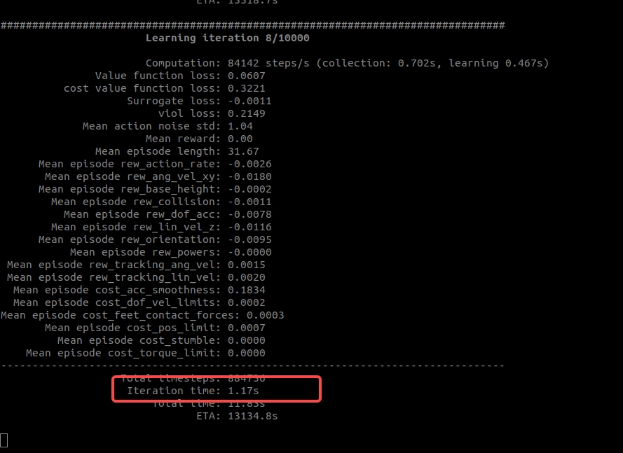

English README.md：be updating...

持续更新中~~~  
  
有问题欢迎在Issues中反馈，欢迎大家一起加入学习。

感谢开源：
1. https://github.com/zeonsunlightyu/LocomotionWithNP3O.git

本次开源有三部分，分别是：  
1. Isaac Gym仿真训练  
        将机器人模型导入到Isaac Gym中，进行仿真训练  
代码仓：https://github.com/talon-huang/tita_rl.git

    
2. sim2sim仿真  
        使用sim2sim仿真，可以更快的检验isaac gym训练成果，为了安全，为了验证程序可行，还有很大程度上排除机器模型一致性问题，sim2sim没有太大的问题就可以开始实机部署  
    代码仓：https://github.com/talon-huang/sim2sim2real.git

3. sim2real仿真  
        sim2real，是比较复杂比较难的部分，这要求实机模型和仿真模型接近一致，同时对硬件和执行部件电机有较高要求，如果sim2sim的效果还不错可以检查一下  
        电机响应时间，电机力矩大小，电机速度噪声，电机位置准确性还有上层控制带宽（控制频率）这都关乎实机的表现性能。  
    代码仓：https://github.com/talon-huang/sim2sim2real.git 


一. 环境搭建（每个人的环境都不一样，以下尽可能的把注意事项写上，遇到问题可以先问AI，也可以查看maybe_problems.md文件，实在不行在Issues上反馈）

1. 安装NVIDIA显卡驱动

    方式1：使用ubuntu软件中心安装驱动  
        http://www.nvidia.cn/Download/index.aspx?lang=cn

    方式2：端中使用apt工具包安装  
        添加 PPA 源：  
    ```markdown
    sudo add-apt-repository ppa:graphics-drivers/ppa  
    ``` 
    为系统安装依赖项以构建内核模块： 
    ```bash 
    sudo apt-get install dkms build-essential  
    ```  
    安装NVIDIA驱动  
    ```bash 
    sudo ubuntu-drivers autoinstall  
    ```
    系统会自动安装推荐版本驱动，安装完重启系统  
    ```bash 
    sudo reboot  
    ```

2. 安装anaconda  
    https://www.anaconda.com/download/success  

3. 安装cuda
    安装完成后用nvidia-smi命令(查看nvidia驱动)，“CUDA Version”提示安装cuda版本的上限，它是12.5，所以我选择安装12.0  
    https://link.zhihu.com/?target=https%3A//developer.nvidia.com/cuda-toolkit-archive

4. 安装tenssorrt  
    我的cuda版本是12.0,所以我安装tensorrt8.6.0  
    https://developer.nvidia.com/nvidia-tensorrt-8x-download

5. 安装issacgym  
    https://developer.nvidia.com/isaac-gym/download  

二. 测试环境

#注意不要照抄指令  
    <your_env_name>为你的虚拟环境名  
    <your_path>为对应文件路径  

1. conda配置虚拟环境
    ```bash
    conda create -n <your_env_name> python=3.8
    ```
    <your_env_name>为你的虚拟环境名该环境配置，在你的anaconda安装路径<your_path>/anaconda3/envs能找到<your_env_name>这个虚拟环境  
2. 激活环境
    ```bash
    conda activate <your_env_name>
    export LD_LIBRARY_PATH=$LD_LIBRARY_PATH:<your_path>/anaconda3/envs/<your_env_name>/lib
    ```
    能在终端开头看到<your_env_name>,说明激活成功

3. 测试conda和issacgym是否安装成功
        安装以下包
    ```bash
    pip3 install torch==1.10.0+cu113 torchvision==0.11.1+cu113 torchaudio==0.10.0+cu113 -f https://download.pytorch.org/whl/cu113/torch_stable.html
    ```
    进入isaacgym安装路径
    ```bash
    cd 你的路径/isaacgym/python && pip install -e .  
    ```
    测试
    ```bash
    cd examples && python 1080_balls_of_solitude.py
    ```
    看到一堆球落到地上表示安装成功，若没有参考第4步的解决方法

4. 可能遇到的问题，“Isaac Gym”没有反应,运行以下两个指令有其它问题查看maybe_problems.md
    ```bash
    sudo prime-select nvidia
    export VK_ICD_FILENAMES=/usr/share/vulkan/icd.d/nvidia_icd.json
5. 退出conda环境
    ```bash
    conda deactivate
    ```

三. 开始训练

1. 从github上下载代码
    ```bash
    git clone https://github.com/talon-huang/tita_rl.git
    cd tita_rl
    ```
2. 激活conda环境   
    ```bash 
    conda activate <your_env_name>
    export LD_LIBRARY_PATH=$LD_LIBRARY_PATH:your path/anaconda3/envs/<your_env_name>/lib
    ```
3. 运行训练程序
    ```bash
    python train.py --task=Tita
    ```
    显存不够会非常卡，看到如下图片，表示程序正常执行，ctrl+c退出

    
    测试使用的事NVIDIA GeForce RTX 3060，打开图形界面的话，会非常卡，跑一次需要9s，建议关闭图形界面
    \
    为了解决显存不足卡顿的问题，我们可以使用--headless参数，这样程序会以命令行的形式运行，不会打开图形界面，这样可以节省显存，提高运行速度
    
    ```bash
    python train.py --task=Tita --headless
    ```
    迭代时间瞬间缩短到2s  
      
    显卡好一点速度会更快，4090的显卡，迭代时间1s左右  
    

四. 测试训练成果
1. 查看训练成果
        训练好的文件在tita_rl/logs下，例如model_10000.pt，将它拷贝到tita_rl主目录下，然后运行能看到
    ```bash
    python simple_play.py --task=Tita
    ```
    
2. 将tita_rl主目录下的test.onnx推理转成model_gn.engine做sim2sim仿真
    ```bash
    /usr/src/tensorrt/bin/trtexec --onnx=test.onnx --saveEngine=model_gn.engine
    ```
    至此，iaacgym仿真和推理部分已经完成，接下来转到sim2sim和sim2real部分。  
    请参考代码仓：https://github.com/talon-huang/sim2sim2real.git